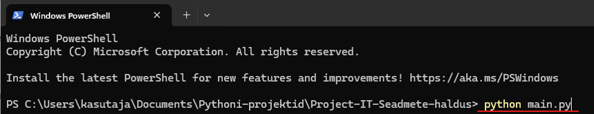
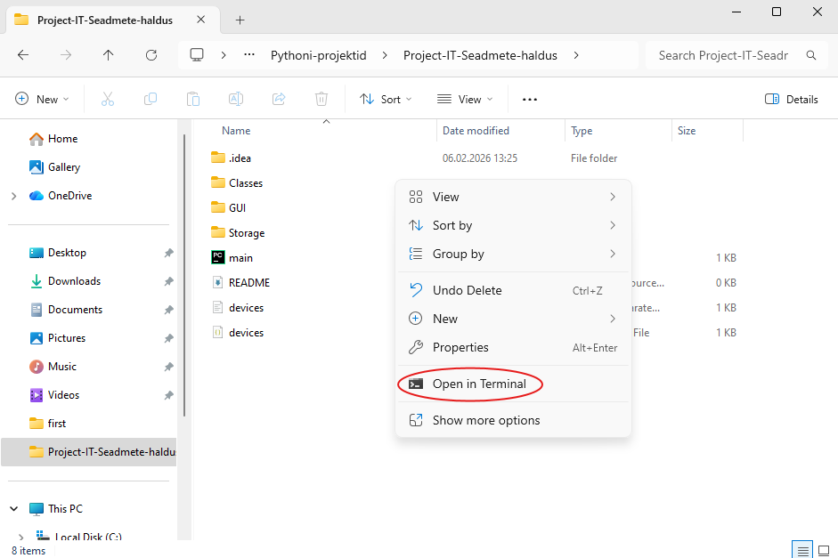

# IT-seadmete haldussüsteem KriSep

## Tehisintellekti kasutamise märkus

See programm on loodud **Claude Code** tehisintellekti abiga.

## Programmi kirjeldus

IT-seadmete haldussüsteem on Pythonis loodud graafilise kasutajaliidesega (Tkinter) rakendus, mis võimaldab hallata IT-seadmete nimekirja.  

Kasutaja saab seadmeid **lisada, muuta, kustutada**, ning **salvestada ja laadida** andmeid **CSV** ja **JSON** failidest.

Lisaväljaks valiti **inventarinumber**

---

# Kuidas käivitada haldussüsteemi KriSep
Arvutis peaks olema  Python 3.10 või uuem.

Esmalt ava terminal projekti kaustas ning käivita programm käsuga: python main.py 
Terminali avamine: 

Programmi käivitamine: 

# CSV/JSON salvestus
Et faili CSV/JSON faile salvestada või avada, tegime eraldi kasutajaliidesele selgelt eristatavad nupud.

## Funktsionaalsus

Programm võimaldab:
- Lisada uusi IT-seadmeid
- Muuta olemasolevate seadmete andmeid
- Kustutada seadmeid nimekirjast
- Kuvada kõik seadmed loendis
- Salvestada seadmed CSV-faili
- Laadida seadmed CSV-failist
- Salvestada seadmed JSON-faili
- Laadida seadmed JSON-failist
